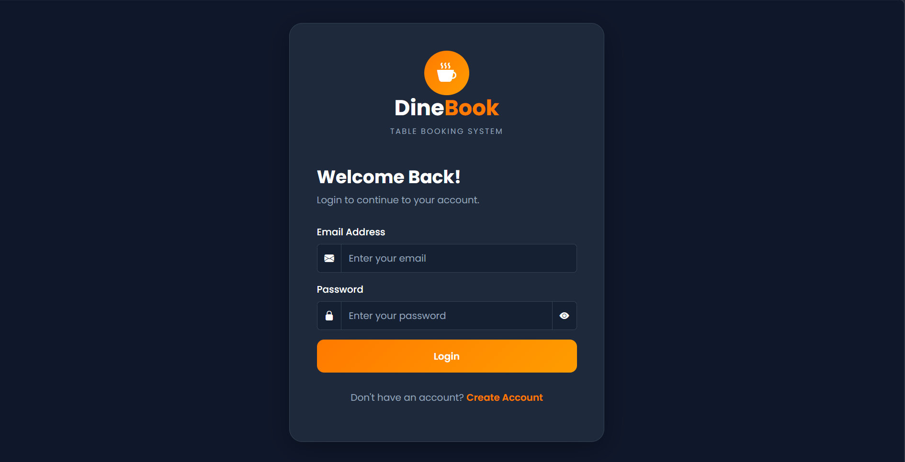
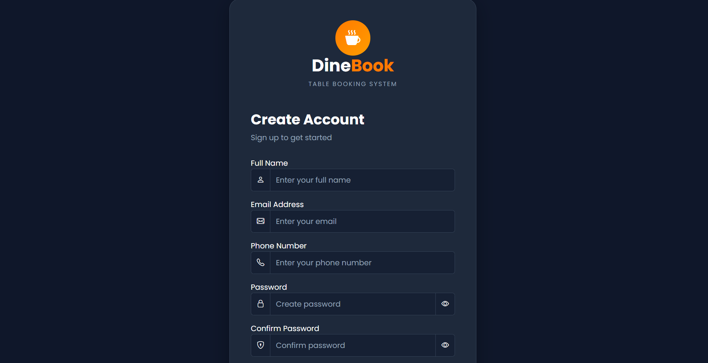
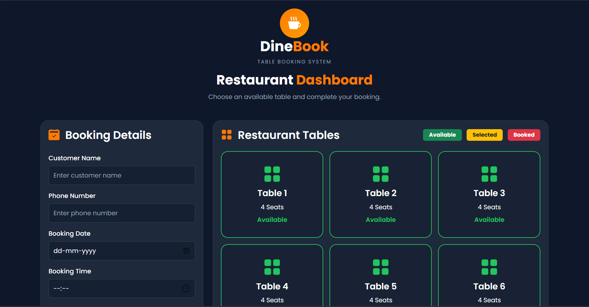

# 🍽️ DineBook - Restaurant Table Booking System

<p align="center">
  
  
  
  
  
</p>

---

# 📖 About the Project

**DineBook** is a responsive Restaurant Table Booking System developed using **HTML, CSS, Bootstrap, and JavaScript**.

The application allows users to register, log in, reserve restaurant tables, and cancel only their own bookings. Booking information is stored using **LocalStorage**, providing persistent data without a backend database.

---

# 🚀 Features

- 🔐 User Registration
- 👤 User Login Authentication
- 🚪 Secure Logout
- 🍽️ Dynamic Table Generation
- ✅ Book Available Tables
- ❌ Cancel Your Own Booking
- 👥 Authorization using `userBy`
- 💾 LocalStorage Data Persistence
- 📱 Fully Responsive UI
- 🎨 Modern Dashboard Design

---

# 🛠️ Technologies Used

- HTML5
- CSS3
- Bootstrap 5
- JavaScript (ES6)
- LocalStorage

---

# 🧠 JavaScript Concepts

- DOM Manipulation
- Event Listeners
- Arrays & Objects
- forEach()
- find()
- filter()
- push()
- JSON.parse()
- JSON.stringify()
- LocalStorage

---

# 📷 Project Preview

## 🔐 Login Page

<p align="center">

</p>

---

## 📝 Register Page

<p align="center">

</p>

---

## 🍽️ Dashboard

<p align="center">

</p>

---

## 🎥 Demo

<p align="center">
  
</p>

▶️ **Watch Full Demo:** [demo.mp4](assets/demo.mp4)

# 📂 Project Structure

```text
DineBook-Table-Booking-System
│
├── assets
│   ├── loginpage.png
│   ├── registerpage.png
│   ├── dashboardpage.png
│   └── demo.mp4
│
├── index.html
├── login.html
├── register.html
├── dashboard.html
├── booking.html
│
├── style.css
├── script.js
├── dashboard.js
├── booking.js
│
├── README.md
└── LICENSE
```

---

# ⚙️ How to Run

1. Clone the repository

```bash
git clone https://github.com/abhijithsm2003/DineBook-Table-Booking-System.git
```

2. Open the project folder.

3. Open **index.html** in your browser.

No installation or dependencies are required.

---

# 🔄 Application Flow

```text
Register
      │
      ▼
Login
      │
      ▼
Dashboard
      │
      ▼
Select Table
      │
      ▼
Book Table
      │
      ▼
Booking Saved to LocalStorage
      │
      ▼
Only the Booking Owner Can Cancel
```

---

# 🎯 Future Improvements

- Firebase Authentication
- Backend Integration (Node.js / Express)
- MongoDB Database
- Admin Dashboard
- Payment Gateway
- Booking History
- Email Notifications
- QR Code Table Booking

---

# 👨‍💻 Author

**Abhijith S M**

- GitHub: https://github.com/abhijithsm2003

---

# ⭐ Support

If you like this project, please consider giving it a **⭐ Star** on GitHub.
